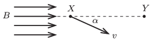

There are two points ($X$  and $Y$ ) on the same $B$ -line at a distance of 10 cm in a uniform magnetic field of magnetic induction $B=0.02$ tesla. An electron, which was accelerated through a potential difference of 800 V, passes point $X$ , such that its velocity encloses an angle of $\alpha$ with the induction line. What may the value of $\alpha$ be if the electron passes point $Y$ as well?

 (5 pont)

