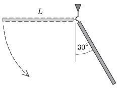

A uniform thin rod of length $L=2$ m is suspended with a hook at the ceiling. The rod is raised into horizontal position and it is released with zero initial velocity. After passing the vertical position, when the rod encloses an angle of $30^\circ$ with the vertical, the rod leaves the hook.
 $a)$ What is the least distance between the ground and the hook, if the rod arrives to the ground in a vertical position?
 $b)$ What is the maximum height of the bottom end of the rod during the motion?

 (5 pont)

