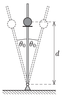

A bumper is mounted to a vertical rod, hinged at its bottom end, at a distance of $d$ from the hinge. There is a small bead at rest on the bumper. The rod is started to vibrate and executes SHM about its original position with a small angular amplitude of $\theta_0$, as shown in the figure. What should the frequency of the vibration be in order that the bead flies off? (Friction is negligible.)

 (5 pont)

