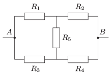

What is the resistance $R_5$ of the bridge circuit shown in the figure if the equivalent resistance between points $A$ and $B$ is 9 $\Omega$? Data: $R_1=5~\Omega$, $R_2=12~\Omega$, $R_3=15~\Omega$, $R_4=8~\Omega$.

 (4 pont)

