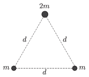

There are three point-like objects in space - far from any other objects - such that their initial velocities are zero, and the distance between any two is the same $d$ . Two of the objects have the same mass of $m$ , and the mass of the third one is $2m$ . Due to the gravitational force the objects begin to move and they collide with each other.
 $a)$ How much distance do they cover until they meet?
 $b)$ How much time elapses until the collision of the objects?

 (5 pont)

