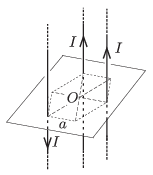

The measure of current flowing in each of three long straight wires through every other vertex of a regular hexagon of edges $a=2$ cm is $I=10$ A. Each wire is perpendicular to the plane of the hexagon, and the direction of the current in two of the wires is upward, whilst in the third wire the current flows downward.
 $a)$ What is the magnitude and the direction of the magnetic induction at the centre of the hexagon?
 $b)$ What is the magnitude and the direction of the force exerted on a $\ell=1$ m long piece of each wire?

 (4 pont)

