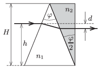

The refractive index of the material of a triangular prism of apex angle $\varphi=45^\circ$ is $n_1=1.3$. The base of the prism is an isosceles triangle of height $H=20$ cm. Another prism of apex angle $\varphi/2$ is attached to the previously described one as shown in the figure. A beam of light enters to the first prism, parallel to the base of the isosceles triangle at a distance of $h=12~$cm from it.
 $a)$ What should the refractive index of the second prism $n_2$ be in order that the light beam emerges parallel to the original beam?
 $b)$ By what distance $d$ is the emerging beam displaced with respect to the entering ray?
 $c)$ How long does a wave-front of the light-beam take to travel through the double prism?

 (5 pont)

