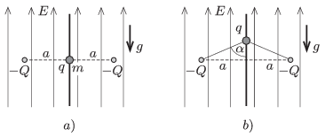

In a region of uniform, vertically upward electric field the magnitude of the electric field strength is $E$ . In this field there are two fixed charges of charge $-Q$ at a distance of $2a$ along a horizontal line. At the midpoint of the line segment between the two charges there is a small bead on a vertical thread (as shown in figure  $a)$). The charge on the bead is $q>0$ and its mass is $m$ . The bead is released from rest. (It can move without friction along the thread.) When the bead reaches the furthest position from its starting point, the two charges and the bead will be at the vertices of an isosceles triangle of vertex angle $2\alpha=150^\circ$, as shown in figure  $b)$.

 $a)$ Find $q$ .
 $b)$ What will the greatest speed of the bead be?
 $c)$ What should the least initial speed given to the bead be, in order that it can reach any (distant) position?
 Data: $E=10^4$ N/C, $a=10$ cm, $Q=10^{-8}$ C, $\alpha=75^\circ$, $m=0.1$ g.
 (5 pont)

