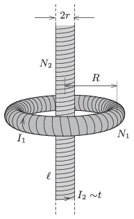

The electric current in a toroid of mean radius $R$ is $I_1$, and its number of turns is $N_1$. A solenoid of radius $r$ and of length $\ell$ ($\ell\gg R$ ), is placed along the symmetry axis of the toroid. The number of turns of the solenoid is $N_2$. In this coil the current is increased uniformly during a time of $t_0$, until the magnetic field in the toroid
 $a)$ becomes zero;
 $b)$ becomes the opposite of the original magnetic field in the toroid.
 Determine the electric field strength in the toroid along its mean radius in both cases.

 Data: $R=20$ cm, $N_1=300$, $r=4$ cm, $\ell=2$ m, $I_1=0.5$ A, $N_2=4000$, $t_0=2$ s.
 (5 pont)

