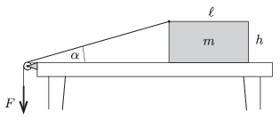

A uniform block of mass $m$ is pulled along the horizontal tabletop as shown in the figure. One end of the thread is attached to the midpoint of the top horizontal edge (perpendicular to the plane of the figure) of the block. The thread is led through a pulley and its other end is pulled by a force $F$ , which is varied in order that the block moves at a constant speed. The coefficient of kinetic friction between the tabletop and the block is $\mu$.

 $a)$ Determine how the tension in the thread depends on the angle $\alpha$ shown in the figure.
 $b)$ What can the maximum value of this angle $\alpha$ be while the block is sliding uniformly as prescribed above?
 Data: $\ell=17.3$ cm, $h=11$ cm, $mg=10$ N, $\mu=0.15$.
 (6 pont)

