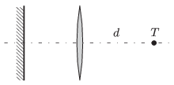

There is a point-like light source $T$ on the principal axis of a converging lens at a distance of $d$ from the lens. There is a plane mirror on the other side of the lens opposite to the lens. The mirror is perpendicular to the principal axis.

 $a)$ If the mirror is moved along the principal axis, then the image of the light source, formed by the system, always coincides with the light source. How can this happen?
 $b)$ The distance between the light source and the lens is doubled. Where should the mirror be placed in order that parallel light rays leave the system.
 (4 pont)

