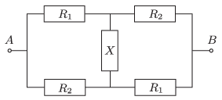

Consider the bridge circuit shown in the figure.

 $a)$ What is the resistance of the resistor in the middle if the equivalent resistance of the system between the points $A$ and $B$ is exactly the same as the resistance of the resistor in the middle: $R_{AB}=X$ .
 $b)$ Is it possible to choose the value of $X$ such that the equivalent resistance is equal to the root-mean-square value of $R_1$ and $R_2$, which is: $R_{AB}=\sqrt{\frac{R_1^2+R_2^2}{2}}$.
 (4 pont)

