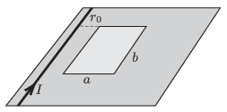

A current of $I=25$ A flows in a piece of wide straight wire, which is fixed to a horizontal plane. The wire can be considered infinitely long. Next to the wire at a distance of $r_0=1$ cm from it there is a closed rectangle shaped loop of copper wire on the horizontal plane. The sides of the rectangle are $a=5$ cm, and $b=10$ cm. The current in the straight wire is decreased to zero uniformly in a very short time. What would the speed of the copper loop be if there was no frictional force exerted to it?

 (5 pont)

