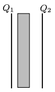

The plates of a parallel plate condenser are charged to $Q_1=2\cdot10^{-5}$ C, and $Q_2=5\cdot10^{-5}$ C, and then an uncharged metal cuboid is inserted into the space between the plates of the condenser. Two faces of the cuboid are parallel to the plates of the condenser and they have the same area as the plates. What are the values of the charges on the surfaces of the left and right faces of the cuboid?

 (4 pont)

