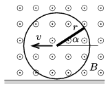

The disc if radius $r$ , shown in the figure is made of some insulating material, and is rolling in uniform magnetic field without slipping along the horizontal ground at a constant speed of $v$ . The magnetic induction $B$ is perpendicular to the plane of the disc. A thin copper rod of radius $r$ joins the centre of the disc with the rim of the disc. Plot the induced electromotive force between the two ends of the copper rod as a function of the angle $\alpha$, which is measured between the rod and the horizontal.

 (4 pont)

