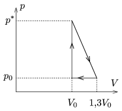

The cyclic process of a thermodynamic heat engine is shown in the figure. What should the least pressure $p^*$ be in order that the efficiency of he heat engine is maximum, if the working substance is some ideal noble gas of constant mass? What is this maximum efficiency?

 (5 pont)

