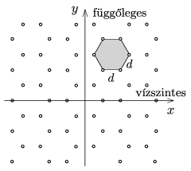

There are small holes on an opaque sheet, the holes positioned in a regular hexagonal grid as shown in the figure. The sheet is illuminated by monochromatic laser light of wavelength $\lambda$ perpendicularly to the sheet.

 What kind of diffraction pattern can be observed on the screen which is placed at a distance of $L$ from the sheet, if the distance between the holes is $d$ ? What can be stated about the brightness of the peak intensities with respect to each other? (It can be assumed that $L\ll d \ll \lambda$.)
 (6 pont)

