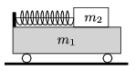

There is an object of mass $m_2=1$ kg at rest on the top of a cart of mass $m_1=2$ kg. Between the object and the wall of the cart at its back there is a spring kept tight with a piece of thread as shown in the figure. After burning the thread the spring pushes the 1 kg object off the cart at a speed of 6 m/s with respect to the ground.

 How much elastic potential energy was stored in the spring? (Friction is negligible.)
 (3 pont)

