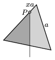

An equilateral triangle is cut from a uniform sheet. The triangle is hung at one point $P$ at its rim. The distance between point $P$ and one of the vertices of the triangle is $x$  times the side of the triangle.

 The vertical line through point $P$ cuts the triangle into two parts. What is the ratio of the masses of these two parts? When will this ratio have an extremum and what is this extremum?
 (5 pont)

