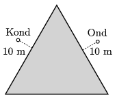

Ond is on holiday at the beach of an equilateral triangle shaped lake. Once, when he is standing 10 m from the water of the lake exactly at one of the symmetry axis of the triangle, he catches the sight of Kond sunbathing at one of the other sides of the lake. Ond's and Kond's positions are symmetrical. What should the path of Ond be in order that he reaches his friend at the shortest time, if his overland speed is 10 km/h and his speed in the water is 2 km/h?

 (4 pont)

