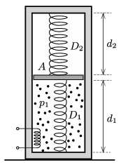

There is a frictionlessly moveable piston in a thermally insulated vertical cylinder closed at both of its ends and of cross section $A=1~{\rm dm}^2$. Two springs (which are both designed for compression and tension) are attached to the piston and to the two bases of the cylinder. The unstretched lengths of the springs are $\ell_1=3~{\rm
dm}$ and $\ell_2=5~{\rm dm}$, whilst their spring constants are $D_1=1000$ N/m and $D_2=1500$ N/m. Bellow the piston there is air, the pressure of which initially is $p_1=4\cdot10^4$ Pa, whilst above the piston there is vacuum. Initially the distances between the piston and the bases of the cylinder are $d_1=5~{\rm dm}$ and $d_2=4~{\rm dm}$.

 $a)$ Determine the mass of the piston.
 $b)$ The air inside cylinder is slowly heated. By what factor should the absolute temperature of the air be raised in order that the piston moves up 10 cm?
 $c)$ How much heat is added to the gas during the heating process?
 (5 pont)

