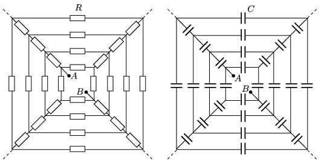

The figure shows the patterns of ``infinite'' connection of resistors and capacitors. The resistance of each resistor is $R$ , and the capacitance of each capacitor is $C$ . Determine the equivalent resistance and the equivalent capacitance between the points $A$ and $B$ .

 (5 pont)

