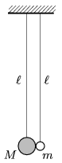

Two pendulums of length $l$ are hanging next to each other, such that the balls at their ends are touching each other as shown in the figure. The mass of one of the balls, $M$, is much greater than that of the other, $m$.

 $a)$ The pendulum on the left is displaced a bit, such that the elevation of the ball of mass $M$ is $h\ll \ell$, and then it is released. After the elastic collision of the balls what maximum height can the ball of mass $m$ reach?
 $b)$ If both balls are deflected into opposite directions, such that both are raised to a height of $h\ll \ell$, then what may be the maximum height to which the ball of mass $m$ goes up after colliding elastically with the other ball?
 (4 pont)

