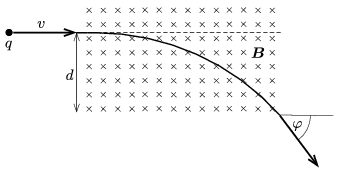

A particle of mass $m$ and of charge $q$ is shot into uniform magnetic field at a speed of $v$. The magnetic induction of magnitude $B$, is perpendicular to the plane of the paper. Before entering into the magnetic field the particle is moving parallel to the (lower) rim of the region of magnetic field at a distance of $d$ from it, as shown in the figure. When passing through the magnetic field the direction of its motion changes by an angle of $\varphi=60^\circ$.

 $a)$ What is the sign of the charge if the induction vector points into the paper?
 $b)$ What is the speed of the particle?
 (4 pont)

