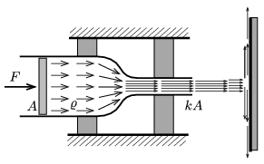

The area of the inner cross section of the left part of a horizontal fixed tube is $A$, whilst the area of the cross section of its part on the right hand-side is $kA$, where $k<1$ (e.g. $k=\frac{1}{5})$. The two parts are attached smoothly without any sharp turns as shown in the figure. In the tube there is some liquid of density $\varrho$ and of negligible viscosity. With the help of a piston at the left hand-side, the liquid can be pushed out of this part of the tube. The water which leaves the tube hits a vertical wall and spreads out, creating a tapering film of fluid.

 $a)$ At what constant speed does the piston move if the external force exerted on it has a constant value of $F$?
 $b)$ What is the force exerted by the water on the vertical wall?
 $c)$ What is the value of the horizontal force which is exerted by the tube on the fastening?
 Suppose that the flow is constant in time (stationary), and that the effect of gravity can be neglected in the problem.
 (6 pont)

