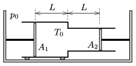

A double cylinder, made of some good conducting material, can move with the help of the wheels attached to it. The wall of the cylinders have negligible width, and the areas of the inner cross section of the cylinders are $A_1$ and $A_2$. In the cylinders there are pistons, which are attached to walls. The distance between the pistons and the plane along which the two cylinders touch each other is $L$. In the confined region there is a sample of oxygen gas at a temperature of $T_0$. The ambient air pressure is $p_0$.

 The temperature is slowly increased to $T_1$.
 $a)$ By what amount does the double cylinder move during the temperature change?
 $b)$ How much heat is absorbed by the oxygen gas in the heating process?
 ( Data: $A_1=10~\rm cm^2$, $A_2=5~\rm cm^2$, $L=10~\rm cm$, $p_0=100$ kPa, $T_0=250$ K, $T_1=300$ K.)
 (4 pont)

