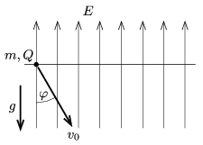

A point-like object of mass $m=1$ g and of charge $Q=2\cdot 10^{-7}$ C is in uniform vertically upward electric field of magnitude $E=6\cdot 10^4$ V/m. The object is given an initial downward speed of $v_0=2$ m/s at an angle of $\varphi=30^\circ$ with respect to the vertical.

 $a)$ To what maximum depth measured from the level of projection does it go down?
 $b)$ How much time elapses until it reaches the lowest position?
 $c)$ What will its distance from its starting point be $t=1.8$ s after it was started?
 (5 pont)

