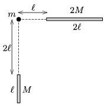

A rod of length $\ell$, and of mass $M$, and another rod of length $2\ell$, and mass $2M$ are arranged as shown in the figure. What is the direction and the magnitude of the gravitational force exerted on the point-like object of mass $m$? (Look for an elementary

