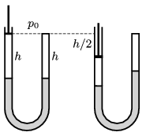

The arms of a U-shaped tube are vertical. The arm on the right side is closed and the other arm is closed by a moveable piston. There is mercury in the tube and initially the level of the mercury in the arms is the same. Above the mercury, there is an air column of height $h$ in each arm, and the initial air pressure is the same as the atmospheric pressure in both arms. How much does the mercury level in each arm move if the piston is slowly pushed down by a distance of $h/2$?

 Data: $h=30$ cm, and the atmospheric pressure is the same as the pressure of a mercury column of height $H=76$ cm.
 (4 pont)

