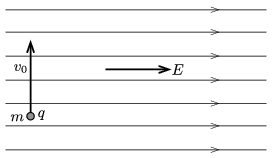

The electric field lines of a vast region of uniform electric field are horizontal. The electric field strength is $E=10^4$ N/C. At one point of this region a metal ball of mass $m=4$ g is projected vertically upward at a speed of $v_0=2$ m/s. Initially the metal ball was charged positively to a charge of $q=3\cdot10^{-6}$ C.

 $a)$ What is the displacement of the ball when its speed becomes the same as its initial speed was?
 $b)$ How much time elapses until this instant?
 $c)$ What is the minimum speed of the ball during its motion?
 $d)$ Where is the ball when it is the slowest?
 (4 pont)

