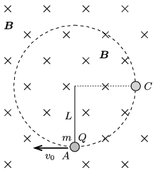

A small ball of mass $m$ and of charge $Q$ is attached to the bottom end of a piece of negligible-mass thread of length $L$, whose top end is fixed. The system formed by the thread and the ball is in uniform magnetic field, $\boldsymbol B$, which is perpendicular to the plane of the figure and points into the paper.

 The ball is started in a direction perpendicular both to the magnetic induction and to the direction of the thread. At a certain initial speed the ball moves along a circular path such that the thread remains tight during the whole motion.
 $a)$ What is the magnitude of the magnetic induction $B$ if the minimum initial speed at which the described motion of the ball occurs is $v_0=\frac 12
\sqrt{17Lg}\,$?
 $b)$ By what factor is the force acting on the thread at point $A$ greater than that at point $C$, when the initial speed of the ball is the above stated one?
 (5 pont)

