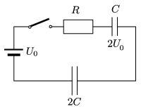

The initial voltage across the capacitor of capacitance $C$, connected as shown in the figure is $2U_0$, whilst the capacitor of capacitance $2C$ is neutral.

 How much heat is dissipated at the resistor of resistance $R$ after closing the switch?
 (6 pont)

