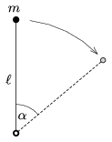

A point-like mass $m$ is attached to one end of a negligible-mass rod of length $\ell$. The other end is fixed to a hinge about which the system can be rotated. At which angle $\alpha$ will the centripetal acceleration of the object at the end of the rod be the same as the tangential component of the acceleration of the object if the system was released from the vertical, unstable position of the rod?
 Does the object pull or push the rod at this instant? (Neglect friction.)

 (4 pont)

