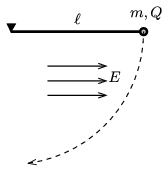

A small ball of mass $m=0.3~$g and of charge $Q=2\cdot 10^{-7}$ C is attached to a thin, negligible-mass thread of length $\ell=20$ cm. The thread with the ball is displaced horizontally, and released without initial speed.

 $a)$ What is the greatest speed of the ball if the whole pendulum is in a uniform horizontal electric field of $E=10^4$ N/C?
 $b)$ What is the angle between the thread and the vertical when the pendulum is in its other extreme position?
 (Air drag is negligible.)
 (4 pont)

