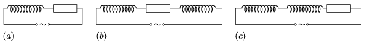

In a series $RL$ circuit $(a)$ the phase difference between the voltage and the current is $45^\circ$. This phase difference is $65^\circ$ and $70^\circ$, when another inductor of inductance $L$ (same as the inductance of the coil in the circuit) is connected in series into the circuit, once next to the resistor as shown in figure $(b)$ and then next to the original inductor as shown in figure $(c)$, respectively. How can this happen?
 What is the ratio of the impedances in the three cases?

 (5 pont)

