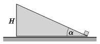

There is a slope of height $H$ and of elevation angle of $\alpha$ at rest on the level ground. There is a small point-like object next to the slope. At what acceleration must the slope be moved in order that the point-like object reaches its top in a time of $t$? (Friction is negligible.)

 Data: $\alpha=30^\circ$, $H=0.2$ m, $t=0.2$ s.
 (4 pont)

