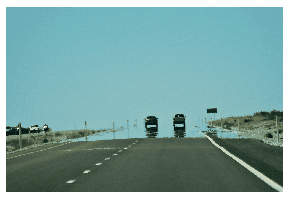

On a hot summer day the photo below was taken on the motorway. The lens of the camera was at a height of 1.8 m, and the nearest part of the mirage (resembling to the water of a puddle) seems to be at a distance of 180 m. Estimate the difference between the refractive index of the air next to the ground and that of at the level of the camera.

 (4 pont)

