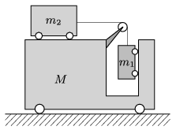

$a)$ At what accelerations do the trolleys shown in the figure start to move if the wheels can roll easily, and the mass of the pulley and air drag are negligible? Data: $m_1=1$ kg, $m_2=2$ kg, $M=5$ kg.

 $b)$ For other mass values, in what interval can the value of the initial acceleration of the trolley of mass $M$ be?
 (5 pont)

