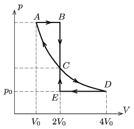

The figure shows the cyclical processes of a heat engine which is operated with a certain amount of ideal, noble gas. Both of the cyclical processes $ABCA$ and $CDEC$ consist of isothermal isobaric and isochoric processes. What is the ratio of the two efficiencies?

 (5 pont)

