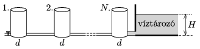

In a big water reservoir the height of the water is $H$. Next to the reservoir there are $N$ number of cylinder shaped water tanks (each at the level of the bottom of the reservoir). The tanks are connected with alike thin tubes. The water tank at one end of the tank system is connected to the bottom of the reservoir through a thicker tube, whilst at the other end of the tank system there is an – initially closed – tap.

 If the tap is opened, then after a long enough time the total volume of the water in the tanks decreases by a value of $V_0$. What is the diameter of the tanks? (The flow of the water is viscous.)
 (4 pont)

