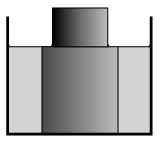

At the centre of a cylinder-shaped glass there is an opaque metal cylinder. There is some transparent liquid in the glass around the cylinder. Observing the cylinder from a distant point, due to the refraction of light the part of the cylinder in the liquid seems wider. At what extent?

 Data: the radius of the glass is 4 cm, the radius of the metal cylinder is 2.5 cm and the refractive index of the liquid is 1.5.
 (5 pont)

