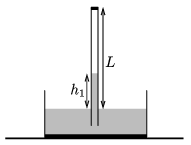

Some argon gas is put into a Torricelli-tube of length $L=1$ m and of cross section $A=2$ cm${}^2$, therefore the height of the mercury in the tube is only $h_1=0.4$ m. The ambient air pressure is $p_0=10^5$ Pa, and the initial temperature is 20 ${}^\circ$C.

 $a)$ What is the mass of the argon gas above the mercury?
 $b)$ The temperature of the gas is slowly increased. What is the temperature of the gas when the height of the mercury in the tube is $h_2=0.36$ m?
 $c)$ How much work was done by the extending gas during the process?
 (5 pont)

