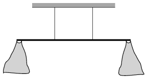

A uniform density rod of mass 1 kg is suspended horizontally at its trisecting points with two vertical threads. Two light bags are attached to the ends of the rod (one to each end) then first only one of them and then the other one as well were filled with biscuits. The rod must stay in its horizontal position all the time, such that it cannot be touched. Altogether how much biscuit can be put into the two bags?

 (4 pont)

