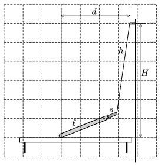

There is a socket at a height of $H$ above a horizontal tabletop. The charger of our mobile phone has a flexible wire of length $h$ and the length of the small, light and rigid part which is joined to the phone is $s$. The phone which is attached to the charger is put onto the table such that it touches the table with one of its shorter side, but from some positions – when the distance $d$ is greater than the value shown in the to scale figure  – the phone slips. The length of the phone is $\ell$, its width is negligible, and it has uniform density.

 Determine with construction the numerical value of the coefficient of static friction between the tabletop and the phone.
 (4 pont)

