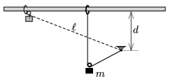

One end of a piece of unstretchable, light thread of length $\ell$ is suspended, whilst the other end is attached to a small ring which can slide without friction along a horizontal rod – at a height of $d<\ell$ above the point of suspension. The thread is held tight, and next to the rod a small object of mass $m$ is placed by means of a pulley onto the thread, and then the system is released.

 $a)$ What will the speed of the object be at the lowermost point of its path?
 $b)$ Along what kind of curve does the object move?
 $c)$ What is the extension in the thread at the lowermost point of the path?
 (5 pont)

