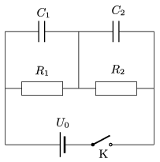

The capacitors in the circuit shown in the figure are uncharged, before turning the switch on. At a certain moment the switch is closed. (Neglect the internal resistance of the voltage supply, the capacitance of the wires and the resistors, and the inductance of any of the elements in the circuit.)

 Sketch a graph of the voltage across the capacitors as a function of time.
 Data: $C_1=150~\mu$F, $C_2=50~\mu$F, $R_1=40~\rm k\Omega$, $R_2=10~\rm
k\Omega$, $U_0=100$ V.
 (5 pont)

