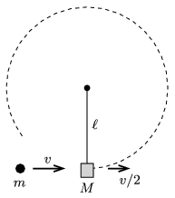

An object of mass $m$ and of speed $v$ is shot through the suspended object of mass $M$, as shown in the figure, and leaves it at a speed of $v/2$. The hung object of mass $M$ is first suspended on a negligible mass rigid rod of length $\ell$, and second it is suspended on a thread of length $\ell$. After the object of mass $M$ was shot through, it moves along the circular path of radius $\ell$ in both cases. Determine the values of the necessary speed of $v$ in both cases. What is the ratio of these speeds?

 (4 pont)

