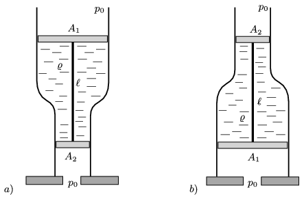

The cross section of the wider part of a fixed vertical tube is $A_1$, whilst that of its narrower part is $A_2$. In the tube, between two pistons, there is some liquid of density $\varrho$. The pistons are connected by means of a rigid rod of length $\ell$. The masses of the rod and the pistons are negligible. The ambient air pressure is $p_0$.
 What is the magnitude and the direction of the force exerted in the rod if
 $a)$ the narrower,
 $b)$ the wider
 part of the tube is on the horizontal tabletop?

 What strange thing happens if $\ell$ is ``relatively large''?
 (6 pont)

