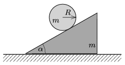

The masses of both the wedge and the solid cylinder shown in the figure are $m$, the radius of the cylinder is $R$. The wedge can slide without friction on the ground. What is the minimum value of the coefficient of static friction between the wedge and the cylinder, if the cylinder rolls without slipping along the wedge and the angle of elevation of the wedge is $\alpha=30^\circ$?

 (5 pont)

