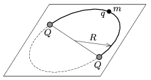

A point-like bead of mass $m$, and of charge $q$ can move frictionlessly along a horizontal semicircular path of radius $R$. At each end of the semicircle there is a point-like fixed object of charge $Q$. The system described is in equilibrium. What is the period of the motion of the bead if it is displaced a bit from its equilibrium position and then released?

 (5 pont)

